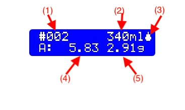

# Introduction
The major benefit by bottling direct from fermenter is reducing oxygen exposure which is introduced by additional equipment, the bottling bucket. Adding sugar to the bottle elminates the necessity of opening the fermenter for adding sugar. It also elminates uneven distribution of sugar in batch priming.

Carbonation drops are convienet but expensive. Also it is difficult to adjust carbonation level. Dosing sugar is yet another solution, but the small openning of bottles makes scooping sugar into bottles a PITA. Not to mention measuring the amount of sugar. Using syringe to dose syrup is more controllable and precise. However, it's just a little better than or equivalent to scooping sugar. 

SugarDoser is the solution. By controlling peristatic pumps, it doses right amount of sugar solution to bottles based on the volume of bottle. A peristatic pump squeezes tube to move liquid. It's hygienic because only the inner of tube touches the liquid, sugar solution. Peristatic pumps have sucking ability, so any type of containers can be used. The perfect precise peristatic pumps are driven by step motors. However, step moters are expensive and heavy. Peristatic pumps driven by DC motor are cheap and light, yet it provide enough precision for homebrew. Unless very high flow pumps are used, the error is small enough, usually less than 0.1g.

# Assemble

- Arduino Nano or Uno
- HD44780 type 16x2 I2C LCD
- KY-040 rotary encoder module
- One way Relay module, or two way relay module
- Buzzer
- Button or QT30CM infra-red sensor(NPN type, or Normal Open, outputs LOW when blocked)
- Peristaltic pump with tube, two for secondary doser
- wires, box, and etc.

Pins    |  connects to | Note#
--------|:-----|------------------------
D2   | Button or QT30CM input | 
D3   | Secondary Doser button/sensor |
D5   | Relay Module IN |
D6   | Secondary Relay Module IN |
D9   | CLK of K040 |
D10  | DT of K040 |
D11  | SW of K040 |
D12  | Buzzer |
A1   | Indicator of primary doser |
A2   | Indicator of secondary doser |
A4   | SDA of LCD |
A5   | SCL of LCD |

]

The schematic shows only electronic components. Machenical parts are necessary to fix output of sugar solution.

### Button v.s. Sensor
There are two types of configurations for triggering dosing. A button or a sensor. Using a button is trivial. Pressing the button to start dosing, and it automaticaly stops when finished. In Manual mode, pressing the button again would stop the flow. 
Sensors work differently. Dosing will start after a short configurable period of time when a bottle is 'sensed'. Dosing would be aborted whenever bottle is removed. The starting of 'Cool Time', specifiying duration to igore triggering, differs for the button and sensor. It starts when dosing finsihed for button configuration, but it starts when the bottle is removed for sensor configuration.

QT30CM is a short range infra-red sensor, which suits this application very well. However, it doesn't work with transparent bottles. Luckily, brown bottles are usually first choice for beer. 

### Dual Dosers
An additional doser can be used to dose tincture or yeast if needed. The secondary doser can have its own triggering, a button or a sensor, and it can also share the same trigger as the primary doser.
Usually, the outlets of both dosers will be grouped togeter if they share the same trigger.
The dosage of the secondary doser can be a fixed amount or propotional to the amount of primary doser. 

# Operation and setup

A rotary encoder is used for operation. Turning the rotary encoder to **change values**, and pressing the rotary encoder to **confirm** or **exit**.

There are four functions after power on.

- Automatic
- Manual
- Run Doser
- Setting

**Automatic** is the key function. It doese right amout of sugar solution when triggered if sugar amount or the ratio is set. In **Manual** mode, the pumps/dosers are manually started or stop. The amount of dosage will be displayed. **Run Doser** can be used to suck or drain liquid, which can also be used to sanitize the tube. **Settings** is for settings, as expected.

The LCD displays af following pictures. Turning the rotary encoder to select functions, and pressing the rotary encoder to confirm execution.

## Automatic 
Press the rotary encoder to exit.

- (1) number of dosage 
- (2) Selected bottle size. It appears when when "Beer Vol." is chosen. Rotate the rotary encoder to change.
- (3) Status: :dosing, :prepare to dose. dosed. :cooling time.
- (4) Accumulated amount of sugar solution dosed.
- (5) Dosage amount.

If **Input** is set to **Beer Vol**, then **(5)Dosage amount** calculated by the parameters in **Priming** settings. If **Input** is set to **Sugar**, turning the rotary encoder will change this value.

#### Automatic mode(雙投料器)
When a secondary doser is used, the display of LCD is something like this.

- (1)Status of the secondary doser
- (2)Dosage cout of the primary doser
- (3)(rounded) Accumumated amount of sugar dosed for primary doser
- (4)Volume of bottle/beer
- (5)Status of the primary doser
- (6)Dosage count of the secondary doser
- (7)Dosage of the secondary doser
- (8)Dosage of the primary doser

In this case of LCD display, the **Input** in **Priming** is set to **Beer Vol**, and **Auto(%)** in **2nd Doser** is set to 1.00%, so the value of **(7)Dosage of the secondary doser** is calculated as 500 * 1% = 5.00. To have fixed amount of the secondary doser, set **Auto(%)** to **0.00**. **Long press** the rotary ecoder, the **2** symbole before (7) will blink, and the number of (7) can be changed by turning the rotary encoder. Press the rotary encoder when finishing editing.

## Manual
It will note the time and amount of sugar dosed. I have no idea how to use this funtion, yet. Press the rotary encoder to exit.

The number on the left is time of dosing, while the right one is total amount of sugar solution dosed.

### Manual(雙投料器)

The upper line shows value of the primary doser, while the bottom line shows value of the secondary doser. Upper right coner is the status of the primary doser, while upper left shows the secondary doser.

## Run Doser
This function is used to run the pumps to suck or drain from the tube.

Press the rotary encoder to start running when "Run" is shown. Turning the rotary encoder to change "Run" to "Exit".
The the pump is running, "Stop" will show, and pressing the rotary encoder again to stop running.

If secondary doser is enabled, selecting which doser is necessary prior to run

## Setting

Turning the rotary encoder to select items, press the rotary encoder to edit values. The values or options will blink to indicate editing mode. Press the rotary encoder to complete editing. There is a **Back** option in each submenu to back to uppper menu.

#### 2nd Doser
There are two options in this submenu.

-  2nd Doser usage: **Disabled**, **Synchron(ized)**, and **Seperate**
    - **Disabled**：Disable the secondary doser, or the secondary doser is not available.
    - **Synchronized**： Share the same triggering of the primary doser.
    - **Seperate**： Use an independent triggering for the secondary doser.
- **Auto(%)** is used to specify the dosage amount of the secondary doser. The unit is %(percentage). If this value is set o **0.00**, the dosage of the secondary doser is fixed and can be set in Automatic mode by long pressing the rotary encoder. The value is based on the **Input** in **Priming**. If it is set to **Beer Vol**, the amount is propotional to the beer volume(or bottle size). If **Input** is set to **Sugar**, the amount is propotional to the sugar amount of the primary doser. The valid range is 99.99% to 0.01%. Editing is 2 steps. The integer part is edited first, and then the fraction part.

The secondary doser is designed to dose tincture or yeast, which sould be hydrated to become liquid. Surely, it can be used to dose any liquid.

#### Unit 
The unit of sugar solution. It can be **Volume** or **Weight**. The volume shoule be propotional to the weight. It's very difficult to measure small volume, so using **Weight** is recommended. (This option might be removed in the future.)

#### Priming
The parameters to calculate the amout of sugar solution in Automatic mode.

- **Input**: **Beer Vol**(beer or bottle volume), or **sugar**. If **Beer Vol** is selected, the dosage will be calculated based the following parameters.
- **Brix**: Brix of sugar solution. 50Brix is recommended.
- **CO2 Vol.**: Desired carbonation level.
- **Beer Temp.**: Beer temperature.

If **Input** is set to **Sugar**, the other 3 options are not used.

#### Dosing Control

The setting of triggering of doser.
 - Control: Button or Sensor
 - Delay： The delay of dosing. It is usually 0 for button. A value higher than 0.5 seconds is recommended with Sensor, because the bottle might be sensed before it is in the right position.
 - Cool Time: A block time between each dosing.

#### Sound Setting 聲音設定
Settings of buzzer. There are 3 conditions: **Button** , **Dose Start**, and **Dose End**.

#### Calibration

To calibrate or derive the flow rate of dosers.

It shows current rate of doser.

Turn the rotary encoder to select **Back** to exit, or press the rotary encoder to start calibration procedure.

Turn the rotary encoder to ajdust the amount for calibration, and then press the rotary encoder.

Plece the container, and trigger(press the button or block the sensor) to dose. Waching the amout output, stop dosing (press the button or unblock the sensor) when the amount is near the amount specified above.

Measure the real amount of the liquid(sugar solution), and press the rotary encoder.

Adjust the value to the real measured value, and press the rotary encoder to finsih.

The flow rates differ for different pumps, tubes, and density of sugar solution. The calibration procedure is necessary if any of them changes.

#### Dose Calibrate 
Staring and stoping the pump might have latency. However, it not necessary to run this calibration if the flow rate is not very high. The calibrated result will be reset if above calibration procedure is performed.

- Input amount of dosage and times。Usually the amount is 3~5g, and 4 ~ 10 times is good enough。
- Place the container, and press the rotary encoder. The dosing will start until finished. 
- Weight the real output, and adjust the value to measured value.

#### Bottles 
Sizes of available bottles. Maximum 10 sizes. The unit is metrics "ml". The value 0 means empty. Imperial unit is not supported. Nor it will be.
It is easy to use metrics.

12oz ~ 350ml
20oz ~ 500ml
22oz ~ 650ml

BTW, 1 gram is 0.1058 oz. Imperial unit is not good for small amount of wight. 

### Consideration of Peristaltic pump

Peristaltic pump with DC motor is used in this project for its low cost and easy-to-control. Depending on the speed of motor and tubing size, peristalitc pumps have different flow rates. Obviously, the higher the rate, the quicker the running. If the bottles are hand held to catch the sugar, dropping of sugar must be quick enough. Otherwise, a few seconds of dropping is fine.
IMO, in 1 second and 3 seconds for hand-held and in-place are reasonable. If 3.5 volume is desired, and the beer is fermented at 20C, 3.5g priming sugar is needed. Given 50Brix sugar solution, gravit is around 1.223, is used. the volume to rung is around
` 3.5/1.233/50%=5.68ml `
So, in 1 and 3 seconds, the flow rates are
`5.68/1*60 = 340.8 ml/min`  and `5.683*60 = 113.6 ml/min`

The is the rough requirement of peristaltic pumps.

(One second is **longer** than you might have thought. Try minicing bottling action, and insert an action of holding the bottle for one second. You will see.)

# Tips
- Run manual mode to suck liquid to tube before running or calibration.
- Different solutions have different viscosity and different flow speed. Don't calibrate only with water. In my experience, sugar solution of 70Brix is like 1/4 rate of water, while 50Brix is almost equal to water. I usualy use 50% solution.
- QT30CM has different types. You should choose NPN Normal Open one, which outputs **LOW** when blocked.

# Note
It is a simple but helpful, yet fun, project. Use the code as you like, and modify the code whatever you want.
Don't ask for Imperial unit support.
