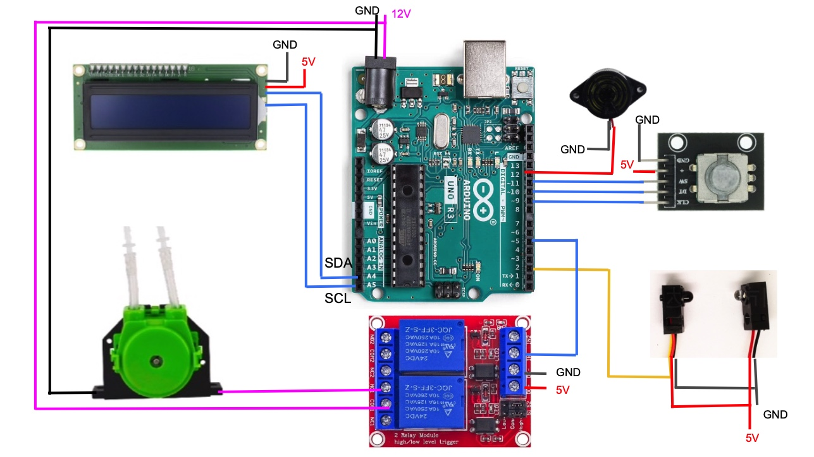

# Introduction
The major benefit by bottling direct from fermenter is reducing oxygen exposure by introduction of additional equipment, bottling bucket.
Adding sugar to the bottle elminates the necessary of opening fermenter for adding sugar. It also elminates uneven distribution of sugar in batch priming.
Carbonation drops are convienet but expensive. Adjusting carbonation level is difficult. The small openning of bottles makes scooping sugar into bottles a PITA.
Not to mention measuring the amount of sugar. Using syringe to dose syrup is more controllable and precise. However, it's just a little better than or equivalent to scooping sugar. 

SugarDoser is the solution. By controlling peristatic pumps, it doses right amount of sugar solution to bottles based on the volume of bottle. More precise and convinent than syringe method.

# Assemble

- Arduino Nano or Uno
- HD44780 type 16x2 I2C LCD
- KY-040 rotary encoder module
- One way Relay module, or two way relay module
- Buzzer
- Button or QT30CM infra-red sensor
- Peristaltic pump with tube, two for secondary doser
- wires, box, and etc.

Pins    |  connects to | Note#
--------|:-----|------------------------
D2   | Button or QT30CM input | 
D3   | Secondary Doser button/sensor |
D5   | Relay Module IN |
D6   | Secondary Relay Module IN |
D9   | CLK of K040 |
D10  | DT of K040 |
D11  | SW of K040 |
D12  | Buzzer |
A1   | Indicator of primary doser |
A2   | Indicator of secondary doser |
A4   | SDA of LCD |
A5   | SCL of LCD |

]

The schematic shows only electronic components. Machenical parts are necessary to fix output of sugar solution.

# Sensor v.s. button
There are two types of configurations for triggering dosing. A button or a sensor. Using a button is trivial: Pressing the button to start dosing. 
Sensors work differently. Dosing will start after a short configurable period of time when a bottle is 'sensed'. Dosing would be aborted whenever bottle is removed.
The starting of 'Cool Time', specifiying duration to igore triggering, differs for the button and sensor. It starts when dosing finsihed for the button, but it starts when the bottle is removed for the sensor.

QT30CM is a short range infra-red sensor, which suits this application very well. However, it doesn't work with transparent bottles. Luckily, brown bottles are usually first choice for beer.

# Dual Doser
Additional doser can be used to dose tincture or yeast if needed. The secondary doser can have its own triggering, a button or a sensor, and it can also share the same trigger as the primary doser.
Usually, the outlets of both dosers will be grouped togeter if they shared the same trigger.
The dosage of the secondary doser can be a fixed amount or propotional to the amount of primary doser. 

# Operation and setup

## Operation & Menu
First level menu: ( rotate rotary encoder to change selection, push rotary encoder to select, also push to exit current application.)

Item   | Description
----|:------------------
Automatic | Automatic mode. The speicifed amount of sugar solution will run out when triggered, button pressed or sensor triggered. Changing the amount of sugar or the size of bottles by the rotary encoder.
Manual    | Manually start/stop running.
Run Doser | Running individual to fill or empty tubes.
Settings  | see next table

Setting Items   | Description
----------|:------------------
Calibration | To clibrate the flow rate of Peristaltic pump. First, input the rough amount, then push button to start running. When rough amount is output, push the button to stop. Measure the real amount by a scale, then input real amount. (The way to start and stop running depends on the triggering setting.)
Dose Calibrate | To derive a correction for one cycle of start and stop. First, input the amount of each drop, and then the times. Push enter to start. When finished, input the real amount of sugar solution dropped. Note, the correction value is reset to zero when "Calibration" procedure is performed. (If a slow peristaltic pump is used, it is not really necessary.) 
Dosing Control | The way to trigger sugar running. **Control**: Button or Sensor. **Delay**: the delay to run the pump. **Cool Time**: minimum gap between dropping. 
Priming   | **Input**: input of **Beer Vol** or **sugar** amount. **Brix**: sugar solution density. **CO2 Vol.**: desired Co2 volume. **Beer Temp.**: beer temperature to calculate priming sugar.
Sound Setting | Buzz or not on events: **Button** (pressed), **Dose Start**, **Dose End**.
Unit | **Volume** or Weight. If the density of sugar solution is even. The volume is proportional to weight. However, different density of sugar solution has different flow rate according to my experiments. 
2nd Doser | Secondary doser usage: **Disabled**, **Synchron(ized)**, and **Seperate**. **Synchronized** mode is used when the output of both dosers are tighten together and primary sensor or button is used to trigger both doser. The secondary doser can have its own trigger if **Seperate** mode is selected. The **Auto(%)** is used for automatic mode to calculate output of secondary. If **beer vol** is selected in **Priming** setting, beer volume input is used to calculate the output of secondary doser. If **Sugar** is selected, sugar amount is used to calculate. The unit is %, so 1 means 1%. eg. 3.3g or ml for 330ml beer volume, or 0.03g for 3g sugar amount. If the value is set to 0(zero), then there is no relation with primary doser. You will/can input the amount of secondary doser manually.
Bottles | Bottle size definitions. Maximum 10 types of bottles can be defined. Sizes of 0 will be ignored.

### Consideration of Peristaltic pump

Peristaltic pump with DC motor is used in this project for its low cost and easy-to-control. Depending on the speed of motor and tubing size, peristalitc pumps have different flow rates. Obviously, the higher the rate, the quicker the running. If the bottles are hand held to catch the sugar, dropping of sugar must be quick enough. Otherwise, a few seconds of dropping is fine.
IMO, in 1 second and 3 seconds for hand-held and in-place are reasonable. If 3.5 volume is desired, and the beer is fermented at 20C, 3.5g priming sugar is needed. Given 50Brix sugar solution, gravit is around 1.223, is used. the volume to rung is around
` 3.5/1.233/50%=5.68ml `
So, in 1 and 3 seconds, the flow rates are
`5.68/1*60 = 340.8 ml/min`  and `5.683*60 = 113.6 ml/min`

The is the rough requirement of peristaltic pumps.

(One second is **longer** than you might have thought. Try minicing bottling action, and insert an action of holding the bottle for one second. You will see.)

### Control
Button is simple to use. Press the button to dose. In manual mode, press to start, and press again to stop. "Delay" is usually zero and "cool time" can be zero, too.
Sensor works differently. A small value of delay is necessary because usually the sensor senses before the bottle is really in place. Non-zero Cool Time is good for preventing mis-triggering. In Manual mode, to stop running, move the bottle/container out of the sensor. In automatic mode, running is stop if the snesor detects the container is out of place. 

### Indicator Pins
Indicator pin will signal high after the doser has dosed right amount and before the bottle is removed. It can be connected to a LED to indicate that dosage has been dosed.

### Secondary Doser
Secondary doser might be helpful to dose tinctured spice or yeast for priming.
Secondary doser can be set as "Disabled", "Synchorn(ized)", or "Seperated".
In Synchronized mode, the same triggering button or sensor as primary doser is used to trigger secondary doser. It is used when the output of both dosers are put at the same place.
The dosage of secondary doser might be linked to primary or not. If it is not linked, i.e. the "Auto(%)" value is 0(zero), then **Long Press** the rotary encoder to switch input to secondary dosage. **Long press** again to back to normal primary dosage input.
In "Seperated" mode, the secondary doser use secondary button or sensor.

# Tips
- Run manual mode to suck liquid to tube before running or calibration.
- Different solutions have different viscosity and different flow speed. Don't calibrate only with water. In my experience, sugar solution of 70Brix is like 1/4 rate of water, while 50Brix is almost equal to water. I usualy use 50% solution.
- QT30CM has different types. You should choose NPN Normal Open one, which outputs **LOW** when blocked.

# Note
It is a simple but helpful, yet fun, project. Use the code as you like, and modify the code whatever you want.
Don't ask for Imperial unit support.
