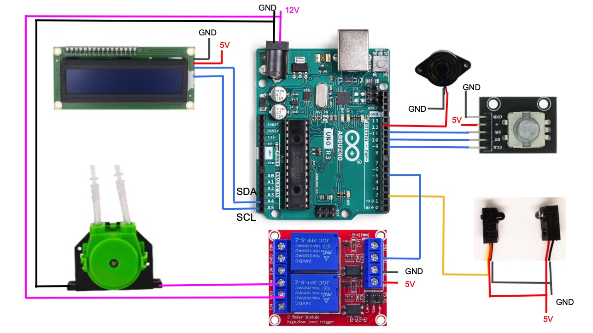
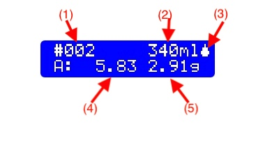

# Introduction
不使用裝瓶桶而直接從發酵桶裝瓶可以減少感染和氧化的機率，直接把瓶發糖投入瓶中更進一步免除了打開發酵桶及攪拌造成的氧化；同時，將糖直接投入瓶中也避免了瓶發糖分佈不均勻的問題。

直接把瓶發糖投入瓶中有幾個做法，最簡單的是專為瓶發設計的Carbonation drop，一瓶一顆或大瓶兩顆，非常方便簡單，但是比較貴，而且無法根據啤酒類型微調碳酸化程度。直接加蔗糖是很便宜且直覺，但要把糖投入窄小的瓶口需要一些耐心，而取糖時的量測比投糖更需要耐心；如果隨便用一小匙之類的做法，就變成了Carbonation Drop的變相做法，而且更不精準 - 這個說法是剛好相反；Carbonation drop的目的就是為了免除量測及方便投入的發明。使用針筒注入糖水應該是相對能夠準確計量的方法，但同樣需要大量的耐心。

自動注糖器就是就是為了解決這個問題的發明，它利用蠕動泵的特性來投入正確的糖量，減輕裝瓶的勞累。蠕動泵是利用擠壓管線的方式來帶動液體，液體只會接觸到管線內壁，在衛生維護上非常有利。附帶自吸的特性，也降低了使用上的麻煩。比較精準的蠕動泵是用步進馬達驅動的，但步進馬達又貴又重，相對的直流馬達可以便宜又輕巧，軟體驅動方式也簡單-只要控制時間就行了。除非使用超大流量（例如大於400ml/s)的泵，誤差應該會在0.1g或更低，以家釀的精準度要求，應該是足夠的。

# Assemble

- Arduino Nano or Uno
- HD44780 type 16x2 I2C LCD
- KY-040 rotary encoder module
- One way Relay module, or two way relay module
- Buzzer
- Button or QT30CM infra-red sensor(NPN type, or Normal Open)
- Peristaltic pump with tube, two for secondary doser
- wires, box, and etc.

Pins    |  connects to | Note#
--------|:-----|------------------------
D2   | Button or QT30CM input | 
D3   | Secondary Doser button/sensor |
D5   | Relay Module IN |
D6   | Secondary Relay Module IN |
D9   | CLK of K040 |
D10  | DT of K040 |
D11  | SW of K040 |
D12  | Buzzer |
A1   | Indicator of primary doser |
A2   | Indicator of secondary doser |
A4   | SDA of LCD |
A5   | SCL of LCD |

]

上圖只有電子零件的部分，還需要像是盒子和像是放置出糖管口的組件。 

### 選項：按鍵 vs. 感應器
觸發出糖有兩種方式：按鍵和感應器。按鍵很直覺，在自動出糖模式(Automatic)下，按一下就出糖，出完自動停止，在手動模式(Manual)下，按一下就出糖，再按一下則停止。感應器有一點不一樣：在自動模式下，當感應到瓶子時，通常會等一個可設定的短暫停再出糖，
出糖過程中如果感應到瓶子移開了，會馬上停止出糖。防止誤觸的「Cool Time」在按鍵和感應器的計算方式也不同：按鍵是出完糖後，而感應器是瓶子移開後。

QT30CM是短距離紅外線遮斷感測器，非常適合用在這個專案，不過它有一個缺點，對透明或紅外線可以穿透的瓶子無效；不過因為啤酒大多用褐色的瓶子，所以通常沒有問題。必要時可以用手遮斷感應。

在 /media 目錄下有試作時期間手持接糖和感應器接糖的影片，大概示範了按鈕和感應器的差別。

### 選項： 雙泵
SugarDropper支援二個泵，第二個可以用來加入浸泡香料或酵母。第二個泵可以有自己的觸發器，也可以和主泵共用。通常如果共用解發器（例如感應器），出口會綁在一起。第二個泵的投料量可以是固定的，或是和主泵的量成比例。

# 操作與設定
操作使用一個旋鈕，轉動為改變，按下為確定或退出。

開機後主選項有四個：

- Automatic(自動出煻)
- Manual(手動)
- Run Doser(投料)
- Setting(設定)

Automatic為主要使用的功能，在設定好出糖量或比例後，只要觸發感應器或按下按鍵，即會輸出正確的糖量。Manual是手動開始、手動停止，會計算輸出的料量。Run Doser可以用來吸入或排空糖水，在開始使用前，也可以先用這個功能來過一些star san消毒液。Settings的詳細說明如下：

開機後會出現顯示，轉動旋鈕改變選擇功能，按下旋鈕確認執行功能：

## Automatic mode
自動出糖模式，按下旋鈕可退出。

- (1) 出糖的次數 
- (2) 目前選擇的瓶子大小，設定輪入為Beer Vol時才會顯示，可轉動旋鈕改變。
- (3) 狀態標誌：:投料中，:準備投料，:己投料，:冷卻防誤觸。
- (4) 累計出糖量
-（5) 單次出糖量

如果是選擇輸入Beer Vol，則(5)單次出糖量是根據瓶子大小和Priming中的參數計算出來的。如果是輸入是sugar，則轉動旋鈕會直接更改這個數值。

## Manual mode
只是記錄出糖的時間和推算的出糖量，目前還沒想到用途。按下旋鈕可退出。

左邊數字為出糖時間，右邊為出糖量。

## Run Doser
用來啓動泵，用來吸取或排空管線。

在"Run"之下，按下旋鈕，即會啓動泵，轉動旋鈕，可以切換成"Exit"，按下即可退出。
在泵運轉的時候，會出現"Stop"，按下旋鈕即會停止。

## Setting

基本操作為轉動旋鈕選擇項目，按下旋鈕，選項會閃動，即為編輯模式，轉動旋鈕可改變數值或選項，確定後按下旋鈕即完成編輯。每個類別中有"Back"，可回到上一層選單。

#### 2nd Doser 第二個投料器
第二個投料器的設定，有兩個設定 ：
- 　三種模式設定: **Disabled**(不使用), **Synchron(ized)**(同步), 以及 **Seperate**(獨立)
    - **Disabled**：不使用或不存在第二個投料哭口。
    - **Synchronized**：同步模式下，投料觸發和主投料器共用，也就是說，會和主投料器同時投料。
    - **Seperate**：獨立模式，使用獨立的觸（按鍵或感應器）。 
- **Auto(%)**：第二個投料器的投料計算，單位為%，所以1代表1%，是主投料器的投料量的比例，這個值如果被設為0，表示第二個投料器的投料量是固定的，在自動模式下可以長按旋鈕來設定。主投料器的投料量的設定如果是**beer vol**，第二投料器的輸出即是根據啤酒體積(或瓶子容積），如果設定是**Sugar**，則是糖量比例。例如，Auto(%)設定為1，而**Priming**中**Input**設定為**Beer Vol**時，當啤酒體積為330ml時，投料量為 330 * 1% = 3.3g。如果是設定為**Sugar**時，則一樣1%的Auto(%)，當出糖量為3g時，第二投料器投料量為 3 * 1% = 0.03g。

第二投料器是為了裝瓶時同時加入其他東西所設計；例如瓶發酵母(必須先水化)，或是用烈酒萃取香料，我有聽說有人在裝瓶時直接加咖啡的，也可以利用第二投料器來加料。

#### Unit （單位）
糖水的單位；可以設定為**Volume**（體積）或Weight(重量)。在糖水密度均勻一致的前題下，體積和重量會成正比。實際上小量的體積很難以精確測量，建議使用重量。（在可能的將來改版可能會取消這個選項，改成固定使用重量。） 

#### Priming （瓶發糖計算）
Automatic模式下，瓶發糖的計算參數輸入。

- **Input** : 自動棤式下輸入**Beer Vol**(啤酒體積/瓶子容積)或**sugar**(糖量) ；選擇Beer Vol，則會根據下三個參數及啤酒體積計算正確的出糖量。Beer Vol為預先輸入的瓶子容量。
- **Brix**: 糖水濃度百方比。 
- **CO2 Vol.**: 目標氣體數。 
- **Beer Temp.**: 啤酒溫度，用的值是發酵結束後的最高溫，通常是發酵結束時的溫度。

如果輸入模式選擇**sugar**，則後三者參數就不會用到。

#### Dosing Control （投料控制）

觸發投料的設定，有三個設定：
 - Control: Button(按鍵)或Sensor（感應器）
 - Delay：延遲投料時間；如果是按鍵投料，通常是設為零；如果是感應器，可以設定一個0.5秒以上的延遲，因為放置瓶子時，可能還沒有放好，就被感應了。
 - Cool Time:避免誤觸的冷卻時間，在下一次出糖前至少需要的等待時間。建議設置大於零的值。

#### Sound Setting 聲音設定
蜂嗚器聲音控制，有三個可以設定: **Button** (按鍵或感應到時), **Dose Start**(開始投料), **Dose End**(投料結束)。

#### Calibration (校正)

用來校正蠕動泵的流速。

進入後出現的顯示：

轉動旋鈕以改變校正量，例如5或10g，然後按下旋鈕。

放好容器，觸發投料：按下按鍵或遮斷感應器。  目測投料接近目標投料量，停止投料：按下按鍵或停止遮斷感應器。

用秤量測投料量，按下旋鈕。

用旋鈕調整顯示為正確測量的投料量，按下旋鈕。 LCD會顯示每秒流數，再按一次旋鈕即結束校正。

不同的泵、管線和糖水濃度，流速會有所不同，用校正的方式來設定出糖量是比較合理簡單的作法。理論上，如果的泵、管線和糖水濃度都沒有改變，不需要每次校正，但建議使用前先試著投料一次，實際測量後確認誤差在合理範圍內。

#### Dose Calibrate （單次投料校正）
校正啓動和停止的遲滯所造成的誤差。如果蠕動泵並非大流速，單次投料校正不是必要的。這個校正值在每次執行上面的校正程序後，會被重設為零。

- 輸入投料量及投料數。通常投料量3~5g，次數4 ~ 10次即可。
- 放好容器，按下旋鈕即會開始自動啓動及停止投料，直到達到指定次數。 
- 結束後用秤測量實際重量，並調整顯示重量為實際重量後按下旋鈕。 

#### Bottles 
設定瓶子的大小，單位為ml。最多有10組設定，設定為0時表示空白。

# 我的原型機
因為沒有類似3D印表機之類的設備、也不具備鐵工或精細的木工能，我的原型機只用我能找到組件完成。剛開始不確定要使用那一個泵，所以我把泵和控制器本體分開，因為泵的控制其實就是電源，所以連接並不困難，而且實作後發現分開有另一個好處：減少電磁干擾（EMI）。馬達很容易產生EMI，事實上，我買了兩種泵，比較大流量的，和小流量的，大流量的泵在運作時，干擾十分嚴重，嚴重到有時候用按鍵也無法控制。所以設計時，要考慮EMI的問題。

我偏好單手作業，這樣一隻手在控制裝瓶時，可以用另一個手裝糖，而且我用小的木條圍成一個圈，標示出瓶底的位置，這樣，我放瓶子時候，不需要去對準出糖的管口，只要把瓶子放在正確的位置就行了。使用感應器，Delay設成1.5秒，瓶子放好就會自動出糖，十分方便。因為我有四五種瓶子，所以原本設計放瓶子的平台是可以更換以適用不同大小的瓶子的，但實際使用時，大部分都是同一種瓶底大小的(330ml的），少數幾個不同大小的（通常是1L的搖擺瓶）直接用手拿著去接就行了。

我前後改了幾次，細節在部落格有[說明](https://www.vito.tw/posts/e887aae98780e680aae582a2e7a781e4b98be5ae9ae9878fe68a95e7b396e599a82/)。

使用原件：
- Arduino Nano 加擴充版
- HD44780 16x2 I2C LCD
- KY-040 旋鈕模組
- 雙路繼電器模組
- 蜂嗚器
- QT30CM(NPN type)
- 2個12v直流馬達驅動的蠕動泵，書面規格最高速120~150ml/s 
- 兩個盒子，杜邦線，接頭，鐵架片，木板等等。

我使用Arduino Nano加擴充版是因為擴充版上有很多GND和5V可以用，實際上需要三組5V/GND（LCD,KY-040, Relay），如果接線沒有問題，Arduino Uno也是可以的。 我最後選擇使用的蠕動泵是12V的，大概是[這一個](https://www.ruten.com.tw/item/show?22212328028709)，我用的矽膠管是3mmx5mm（內徑x外徑)，一次加糖量大約要3~5秒。

實際使用步驟：
- [事前設定]我常用的瓶子主要是330cc的，另外有500cc, 600cc, 1L搖擺瓶，也有幾個250cc的小瓶子。2L的保特瓶很少用，支援收飲台那個瓶子其實是350~360cc，不過只有一個（現在也不見了），就當成330cc的，反正要送比賽就不用它就是了。
- [事前設定]校正。試過幾次，沒有換矽膠管，數值不太會變動，小泵的啓動停止遲滯也不大。
- 調製50Brix的糖水：先用Brewersfriend.com的計算器，啤酒量算出大概的糖量，再加上10~20%；多了並不會浪費太多錢，少了很麻煩。加入同等重量的水，也就是50% Brix的糖水。我用Pint(450ml左右）的梅森罐和一個有開吸管口附塞子的蓋子裝水和糖，放入電鍋蒸。電鍋跳起來的時候，通常糖沒辦法完全溶解，部分糖會沈澱在底部，所以要帶上防熱手套，把梅森罐拿起來搖一搖，通常搖個一分鐘就會完全溶解了。接著可以把梅森罐拿出放涼，或放水盆中加速冷卻。（警告：有些雜牌的梅森罐不耐熱，建議使用美國的Ball牌梅森罐。）
- 設定瓶發參數：氣體數、啤酒溫度及糖水濃度。
- 消毒管路：用Run Doser，吸入star san，跑個一分鐘，然後排空矽膠管的star san。
- 將矽膠管插入裝糖水的梅森罐，用Run Doser把糖水吸到管中。
- 測試：轉到Automatic，先秤量筒重量，然後遮斷感應器，出糖到量筒，測量出糖量是和顯示的誤差是否在可接受範圍。
- 根據瓶子大小，選擇容量，自動出糖。
